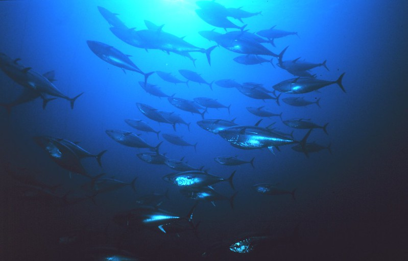
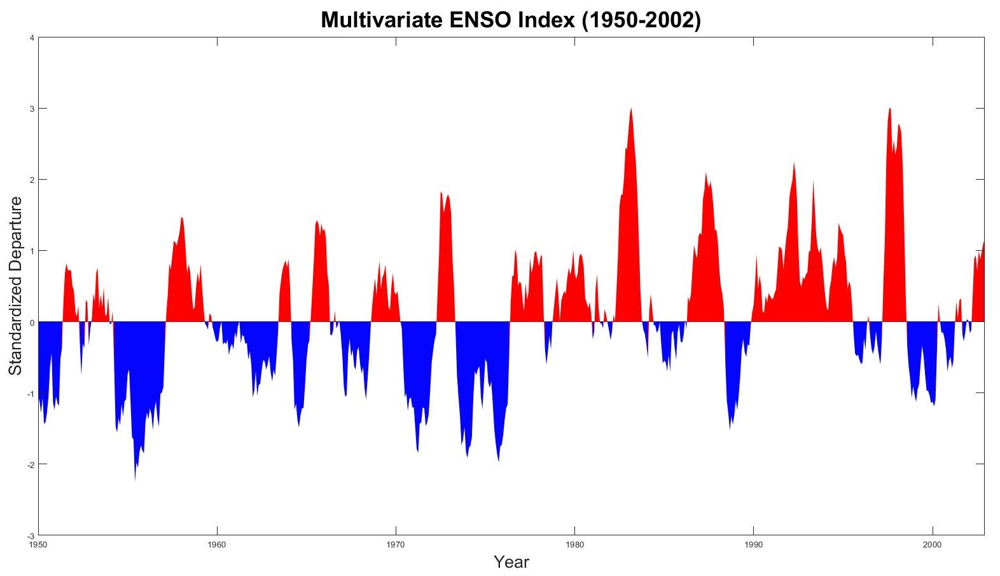
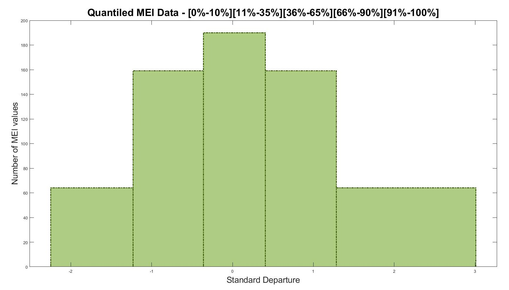
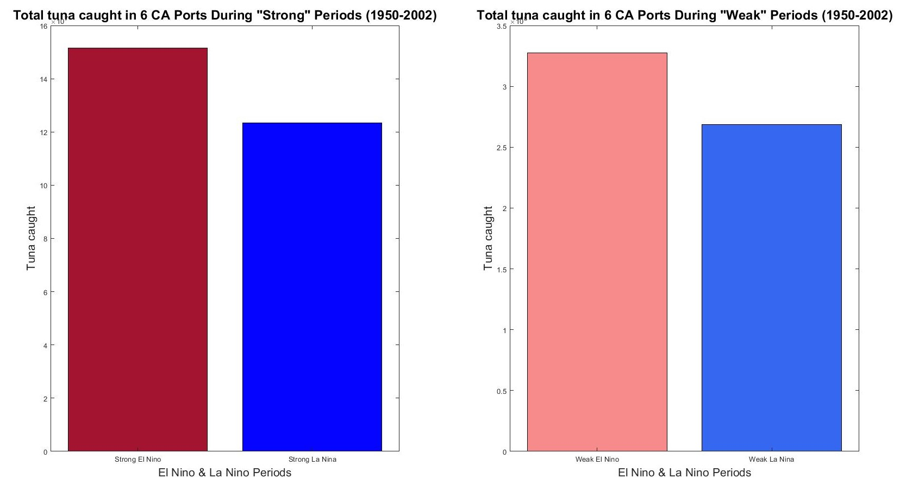
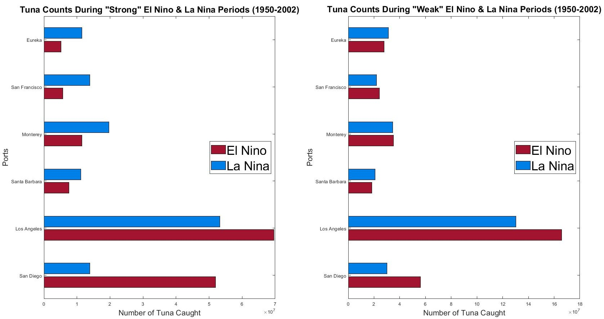
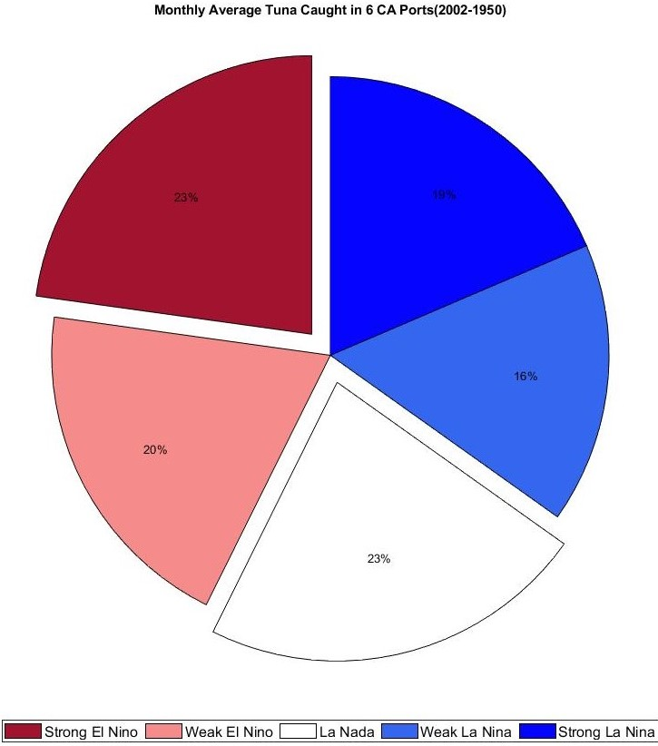
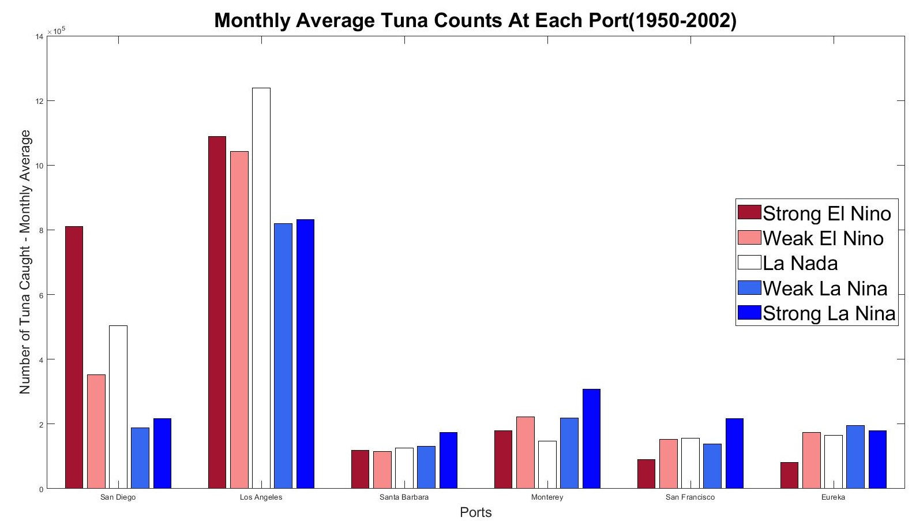

This is my data analysis and visualization project on relating fish take and temperature to monitor seasonal migrations of tuna off the coast of California. Project was written in MATLAB. 

Team: Ricky Medrano, Jazmin Horvet

  
  USFWS under CC-BY-SA 2.0

### Introduction

The El Niño/Southern Oscillation (ENSO) is an important coupled ocean-atmosphere phenomenon that occurs over an irregular period of three to eight years. It is characterized by changes in air pressure and sea surface temperature and affects localized climates differently. Monitoring of ENSO events is performed by NOAA through the Multivariate ENSO Index (MEI) which integrates six variables including sea-level pressure, zonal and meridional surface winds, sea surface temperature, surface air temperature and total cloudiness fraction of the sky. The single MEI value recorded for each month is an average of the given month and the two months immediately before and after. Variation is recorded as a standard departure from the average for each month. With confirmed effects of El Niño periods on offshore kelp communities in California, the MEI data was used to test environmental context to compare fish take to. The ERDDAP database maintains records of fish catches reported at six ports along California’s coast. The dataset titled, California Fish Market Catch Landings, Short List, 1928-2002, Monthly, has 57 combined categories of fish caught off the coast of California and landed at six California ports: Eureka, San Francisco, Monterey, Santa Barbara, Los Angeles and San Diego. The fish reported in these data were used to track the movement of six species of tuna populations during different ENSO categories.

#####  #ELI5
Can changes in tuna population related to El Niño be detected through fish caught at key ports along the coast of California?

##### Dataset
California Department of Fish and Game,  NOAA Environmental Research Division, Coastwatch. (2018). California Fish Market Catch Landings, Long List, 1928-2002, Monthly-- concatenated [Dataset]. Retrieved from https://coastwatch.pfeg.noaa.gov/erddap/tabledap/erdCAMarCatLM.html

### Background

MEI data was pulled from NOAA Earth System Research Laboratory website. The data spans from 1950 until present but only monthly values from 1950 to 2002 were used as the ERDDAP fish data terminates in 2002. The MEI data is measured as a standard departure in a continuous interval from -2.2470 to 3.0080 and spans 636 months.

  

The below histogram shows the five ENSO categories we defined with “Strong” and “Weak” bins having equal number of values, and a control group La Nada in the middle. An effort was made to define ENSO categories based on quantitative methods, but a look into the research turned up no clearly defined MEI values as cutoff points. In addition, any values that would turn up would result in categories with uneven sample sizes resulting in weaker statistical analyses.

  

With MEI values categorized, the corresponding tuna data was indexed and then vectorized into bins based on port location and overall fish catch across all six ports. This resulted in having tuna counts for each port during periods of “Strong” El Niño, “Strong” La Niña, “Weak” El Niño, “Weak” La Niña, and La Nada, and cumulative fish counts for each category across all ports. 

### Results
Cumulative tuna catch data across all ports was aggregated for “Strong” and “Weak”  El Niño and La Niña to be compared visually. The above graph on the left shows more tuna was caught across the 64 months of “Strong” El Niño compared to the 64 months of “Strong” La Niña. The bar graph on the right shows the same trend of more tuna caught in the 159 months of “Weak” El Niño to the 159 months of “Weak” La Niña. 

  

Next, a visual representation of tuna caught across the ENSO categories by each port was generated.

  

The above graph on the left shows more tuna caught in San Diego and Los Angeles in the“Strong” El Niño periods than in the“Strong La Niña” periods. The ports Santa Barbara, Monterey, San Francisco, and Eureka showed the opposite where more tuna was caught in the“Strong” La Niña periods than the“Strong” El Niño periods. The bar graph on the right represents tuna catches during the“Weak”El Niño and La Niña periods and shows the same results as the bar graph on the left with the exception of San Francisco having a slightly higher tuna catch in the “Weak” El Niño period than the“Weak”La Niña period. 

A pie graph was then generated to show proportionality of average monthly tuna catches across the five ENSO categories.

  

“Strong”and "Weak” La Niña periods represent the lowest percentages in average monthly tuna catch with“Strong”El Niño and La Nada tied for highest percentage of average monthly tuna catch. 

This data was broken down further to see differences in average monthly tuna catches by the six ports.

  

Average monthly tuna catches in Santa Barbara, Monterey, and San Francisco shows “Strong” La Niña being greater than the other four categories. In Eureka, all categories are almost equal with the exception of average monthly tuna catches being visually much lower for “Strong” El Niño. San Diego shows “Strong” El Niño monthly average tuna catch leading the four other categories while La Nada leads in Los Angeles. 

##### Stats

Two different statistical tests were used to test our hypothesis. First, the data was binned into histograms and showed it was right-skewed. Numerous iterations were attempted to transform the data by moving down the powers, taking the log and adjusting for zero values, and taking the square root with a plus 0.5 adjustment to each value by assuming a Poisson distribution. After each of these data transformations, an Anderson-Darling test  was run in Matlab. All of the data transformations analyzed with the Anderson-Darling test failed to result in a normal distribution.
Since verifying the data could not be transformed into a normal distribution, we used statistical tests for non-parametric data. For paired data comparison, we used the Wilcoxon Signed Rank test, and for independent data comparisons we used the Wilcoxon Sum Rank test. The following shows the results of our Wilcoxon tests where our hypothesis is that the fish count data in column 1 is significantly different than the fish count data in column 2.

| **Fish Data 1**   | **Fish Data 2**  | **Significantly Different?** | **alpha** | **p-Value** | **Test**  |
| ----------------- | ---------------- | ---------------------------- | --------- | ----------- | --------- |
| ||**ALL PORTS**                                                                                                    |
| “Strong” El Niño  | “Strong” La Niña | No                           | 5%        | 0.1789      | Sign Rank |
| “Weak” El Niño    | “Weak” La Niña   | No                           | 5%        | 0.2542      | Sign Rank |
| La Nada           | “Strong” El Niño | No                           | 5%        | 0.1015      | Rank Sum  |
| La Nada           | “Weak” El Niño   | No                           | 5%        | 0.5644      | Rank Sum  |
| La Nada           | “Strong” La Niña | No                           | 5%        | 0.5544      | Rank Sum  |
| La Nada           | “Weak” La Niña   | Yes:star:                    | 5%        | 0.0186      | Rank Sum  |
| ||**SAN DIEGO**     |
| “Strong” El Niño  | “Strong” La Niña | No                           | 5%        | 0.3190      | Sign Rank |
| “Weak” El Niño    | “Weak” La Niña   | No                           | 5%        | 0.2542      | Sign Rank |
| La Nada           | “Strong” El Niño | No                           | 5%        | 0.2132      | Rank Sum  |
| La Nada           | “Weak” El Niño   | No                           | 5%        | 0.3727      | Rank Sum  |
| La Nada           | “Strong” La Niña | No                           | 5%        | 0.4902      | Rank Sum  |
| La Nada           | “Weak” La Niña   | Yes:star:                    | 5%        | 0.0231      | Rank Sum  |
| ||**LOS ANGELES**   |
| “Strong” El Niño  | “Strong” La Niña | No                           | 5%        | 0.2968      | Sign Rank |
| “Weak” El Niño    | “Weak” La Niña   | Yes:star:                    | 5%        | 0.0370      | Sign Rank |
| La Nada           | “Strong” El Niño | No                           | 5%        | 0.2037      | Rank Sum  |
| La Nada           | “Weak” El Niño   | No                           | 5%        | 0.9516      | Rank Sum  |
| La Nada           | “Strong” La Niña | No                           | 5%        | 0.5503      | Rank Sum  |
| La Nada           | “Weak” La Niña   | Yes:star:                    | 5%        | 0.0095      | Rank Sum  |
| ||**SANTA BARBARA** |
| “Strong” El Niño  | “Strong” La Niña | No                           | 5%        | 0.8644      | Sign Rank |
| “Weak” El Niño    | “Weak” La Niña   | No                           | 5%        | 0.9602      | Sign Rank |
| La Nada           | “Strong” El Niño | No                           | 5%        | 0.5917      | Rank Sum  |
| La Nada           | “Weak” El Niño   | No                           | 5%        | 0.7316      | Rank Sum  |
| La Nada           | “Strong” La Niña | No                           | 5%        | 0.7361      | Rank Sum  |
| La Nada           | “Weak” La Niña   | No                           | 5%        | 0.2606      | Rank Sum  |
| ||**MONTEREY**      |
| “Strong” El Niño  | “Strong” La Niña | No                           | 5%        | 0.9599      | Sign Rank |
| “Weak” El Niño    | “Weak” La Niña   | No                           | 5%        | 0.3976      | Sign Rank |
| La Nada           | “Strong” El Niño | No                           | 5%        | 0.1398      | Rank Sum  |
| La Nada           | “Weak” El Niño   | No                           | 5%        | 0.2968      | Rank Sum  |
| La Nada           | “Strong” La Niña | No                           | 5%        | 0.4730      | Rank Sum  |
| La Nada           | “Weak” La Niña   | No                           | 5%        | 0.5228      | Rank Sum  |
| ||**SAN FRANCISCO**                |
| “Strong” El Niño  | “Strong” La Niña | No                           | 5%        | 0.7566      | Sign Rank |
| “Weak” El Niño    | “Weak” La Niña   | No                           | 5%        | 0.1956      | Sign Rank |
| La Nada           | “Strong” El Niño | No                           | 5%        | 0.3703      | Rank Sum  |
| La Nada           | “Weak” El Niño   | No                           | 5%        | 0.5608      | Rank Sum  |
| La Nada           | “Strong” La Niña | No                           | 5%        | 0.8304      | Rank Sum  |
| La Nada           | “Weak” La Niña   | No                           | 5%        | 0.3746      | Rank Sum  |
| ||**EUREKA**        |
| “Strong” El Niño  | “Strong” La Niña | No                           | 5%        | 0.7998      | Sign Rank |
| “Weak” El Niño    | “Weak” La Niña   | No                           | 5%        | 0.6514      | Sign Rank |
| La Nada           | “Strong” El Niño | No                           | 5%        | 0.6920      | Rank Sum  |
| La Nada           | “Weak” El Niño   | No                           | 5%        | 0.4948      | Rank Sum  |
| La Nada           | “Strong” La Niña | No                           | 5%        | 0.4144      | Rank Sum  |
| La Nada           | “Weak” La Niña   | No                           | 5%        | 0.9308      | Rank Sum  |

### Discussion

Data analysis of tuna caught at six ports in California from 1950-2002 yielded partial visual confidence in our hypothesis through our plots that we generated in MatLab. Visualizing cumulative tuna data from all ports in our graphs shows more tuna was caught in “Strong” El Niño periods compared to “Strong” La Niña periods, likewise with “Weak” El Niño periods compared to “Weak” La Niña periods. This was also evident in the two most southern ports of San Diego and Los Angeles. However, the four ports to the north, Santa Barbara, Monterey, San Francisco, and Eureka demonstrated visually that more tuna was caught in the “Strong” and “Weak” La Niña periods compared to the “Strong” and “Weak” El Niño periods, respectively. 

Direct comparisons between “Strong”, “Weak”, and La Nada periods was not possible with cumulative fish counts as those periods did not contain the same amount of months worth of fish catch data. A monthly average tuna count was calculated instead to compare with a pie and bar chart. We see in the pie chart that monthly average tuna catch was highest during the “Strong” El Niño periods, although the same percentage was seen for the control group La Nada. The bar graph breaks down monthly average tuna catch for each ENSO category by port. None of the ports demonstrate any kind of trend visually amongst these categories other than much more tuna overall was caught at the two most southern ports of San Diego and Los Angeles compared to the other four ports to the north.  

Next, we attempted to reject our null hypothesis that number of fish caught in different El Niño categories would be the same, with the Wilcoxon Sign Rank and Rank Sum tests. In our table above with our statistical results, we see that the only significant difference in fish catch between categories was seen in the “Weak” La Niña against the control La Nada. This is not in agreement without hypothesis although we feel many factors could be skewing our results. 

The obvious indicator of why we failed to reject our null hypothesis was our data on fish catch is not indicative of tuna population numbers at each ports spatial location. Our data represents fish caught for consumption, not for population estimation. In addition, our fish data from ERDDAP did not specify how many boats or how many hours were spent each port catching fish eat month. Therefore, only a few boats out of Eureka would limit the amount of fish being caught compared to a large number of boats out of San Francisco. Gathering population specific tuna estimations would produce a better understanding of the distribution of tuna off the California coast during varying ENSO periods.

